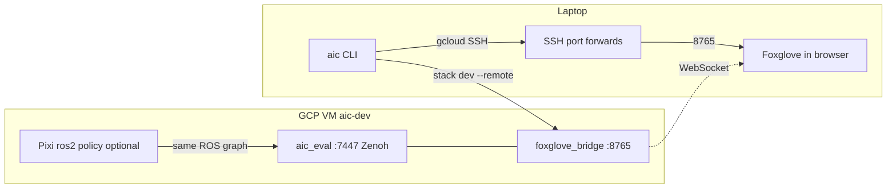
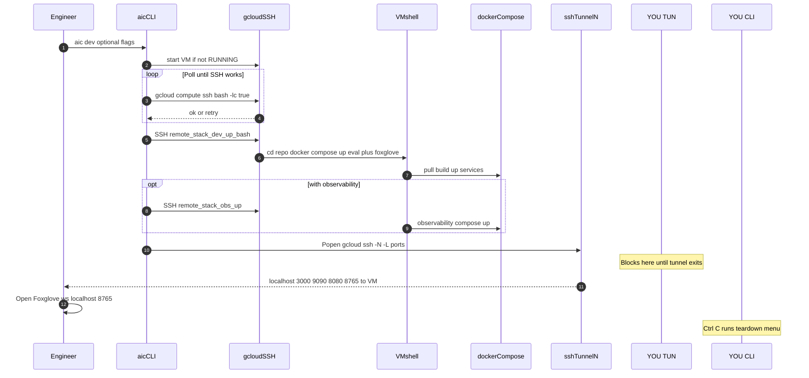
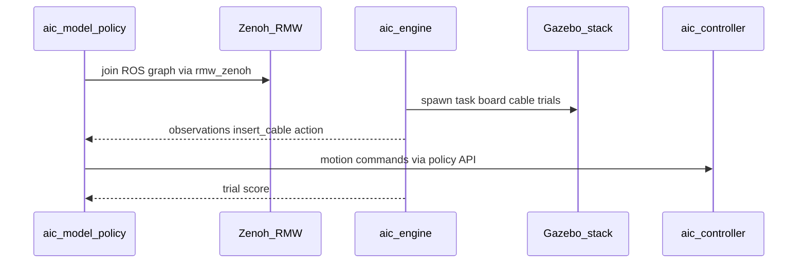

# How the unified AIC platform fits together

This document explains how the **`aic`** CLI, the shared GCP **`aic-dev`** VM, Docker Compose stacks, Foxglove, and **policy execution** relate to each other. For CLI flags and commands, see [**`scripts/README.md`**](../scripts/README.md).

---

## Roles at a glance

| Piece | Runs where | Purpose |
|--------|------------|---------|
| **`aic`** ([`aic`](../scripts/aic) + [`aic_cli.py`](../scripts/aic_cli.py)) | Your laptop | `gcloud` VM lifecycle, SSH, remote `docker compose`, port-forward tunnels, guided teardown |
| **`aic_eval`** container | GCP VM (`aic-dev`) | Gazebo (headless in typical dev stacks), **`aic_engine`**, Zenoh router on **7447**, trials / scoring |
| **`foxglove_bridge`** container | Same VM | WebSocket **8765** to ROS/Zenoh; URDF rewrite for browser assets |
| **Observability stack** (`observability.compose.yaml`) | Same VM | Prometheus, Grafana, cAdvisor, node-exporter, DCGM |
| **`aic_model`** (policy node) | VM worktree with Pixi, **or** `model` service in **`docker/docker-compose.yaml`** | Subclasses implement `insert_cable`; talks to sim/controller via **Zenoh**/ROS discovery |
| **`AIC_RESULTS_DIR`** | Paths on VM (or bind mounts) | Per-run artifact isolation |

---

## Architecture (end-to-end)

On the VM, **dev compose** puts **`aic_eval`** and **`foxglove_bridge`** on one Docker bridge network; **`foxglove_bridge`** uses **`tcp/aic_eval:7447`**. From your laptop, **`aic tunnel`** binds local ports **3000 / 9090 / 8080 / 8765** to localhost on the VM so Grafana, Prometheus, cAdvisor, and Foxglove look like local URLs.



**Do not** run **`dev.compose.yaml`** and **`observability.compose.yaml`** **both** if that would duplicate **`aic_eval`** / port binds on one host unless you deliberately split workloads ( [**observability.md**](./observability.md) ).

---

## Two runtime layouts for policies

### A) Shared VM + dev compose (typical **`aic dev`** path)

Compose file: [`compose/dev.compose.yaml`](../compose/dev.compose.yaml) — **`aic_eval`** + **`foxglove_bridge`** only (no **`model`** service).

You bring up the stack with **`aic stack dev`** (local or **`--remote`**) or the full **`aic dev`** path, then run the policy **in a separate shell on the VM** (Pixi in the cloned repo):

```bash
pixi run ros2 run aic_model aic_model \
  --ros-args -p use_sim_time:=true -p policy:=aic_example_policies.ros.WaveArm
```

The policy connects to Zenoh/router matching **7447** (see [**Getting Started**](../../docs/getting_started.md) Zenoh snippets). **`aic dev`** itself does **not** start **`ros2 run`** — you SSH in separately.

### B) Repo-root “test” compose (eval + model containers)

Compose file: [`docker/docker-compose.yaml`](../../docker/docker-compose.yaml):

- **`eval`** image runs the same **`/entrypoint.sh`** ROS launch as **`aic_eval`** elsewhere.
- **`model`** runs **`aic_model`** inside its image with **`AIC_ROUTER_ADDR=eval:7447`** on the compose network (`eval` resolves to the **`eval`** container).

Start with **`aic stack test`** (local or **`--remote`**). The **`aic`** teardown menu can **`docker compose … stop model`** when that stack was tracked.

### CheatCode and **`ground_truth`**

For **`CheatCode`** the sim must publish ground-truth frames: set **`AIC_GROUND_TRUTH=true`** (or **`--ground-truth`**) **before** `compose up` for **`aic_eval`**, consistent with **`dev.compose`** and [**example policies**](../../aic_example_policies/README.md).

---

## Sequence diagram: **`aic dev`** from the laptop

`aic session` is an alias of **`aic dev`** (same behaviour).



On **Ctrl+C**, **`teardown_menu()`** asks whether to tear down only tunnels, tracked remote **`compose down`**, stop **`model`** (if **`stack test`** was used earlier in the tracked session pattern), or stop the VM with **`YES`**.

---

## Sequence diagram (conceptual): one insert-cable trial

This is ROS-level logic, independent of **`aic`**: **`aic_engine`** drives trials **`aic_model`** joins as the participant policy.



---

## How teardown relates to manually run policies

| Situation | What **`aic`** can stop remotely |
|-----------|----------------------------------|
| You used **`aic stack test`** and **`model`** is running | **`compose stop model`** (menu choice 3) when tracked. |
| **`pixi run ros2 …` on VM host**, not **`aic`** | Not tracked by **`aic`** — stop from that terminal (**Ctrl+C**). |
| Tunnel only | (**Ctrl+C** → menu choice 1) kills **`gcloud … -N`** port-forwards. |

---

## Related docs

| Topic | Where |
|--------|-------|
| CLI reference | [**`scripts/README.md`**](../scripts/README.md) |
| Foxglove + URDF in browser | [**`foxglove_urdf_handoff.md`**](./foxglove_urdf_handoff.md) |
| VM bootstrap / SSH | [**`vm_instance.md`**](./vm_instance.md) |
| Shared dirs / worktrees | [**`gcp_shared_devflow.md`**](./gcp_shared_devflow.md) |
| Metrics stack details | [**`observability.md`**](./observability.md) |
| Policy API | [**`docs/policy.md`**](../../docs/policy.md) |
| WaveArm / CheatCode examples | [**`aic_example_policies/README.md`**](../../aic_example_policies/README.md) |
