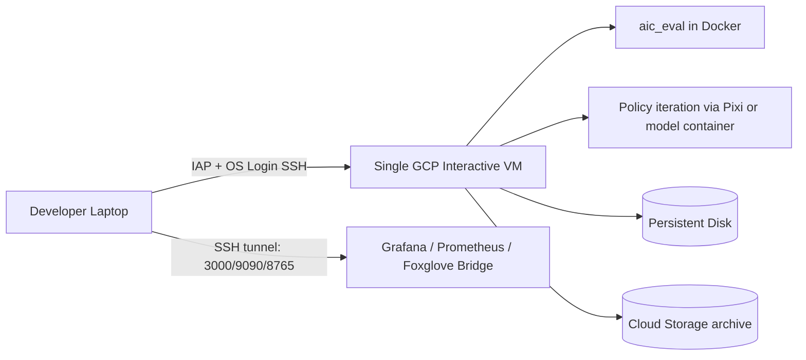

# Shared GCP Development Flow

**Role:** Generic recommendations (machine family, access pattern, development loop) before you standardize on concrete instances. For the **provisioned `aic-dev` record** (hardware, costs, phased bootstrap), see [vm_instance.md](./vm_instance.md).

This is the recommended development flow for moving the project onto GCP Compute Engine without relying on X11 forwarding.

## Goals

- Shared remote hardware backend for the team
- Browser-first access where possible
- Observable and debuggable runtime
- Clean boundary between interactive debugging and batch training
- Minimal redesign when the workflow later moves to SLURM

## Recommended Shape

Start with one shared interactive GPU VM and keep the option to add separate headless runners later.

Recommended first VM:

- OS: Ubuntu 24.04
- Machine family: G2
- Initial shape: `g2-standard-32`
- Disk: 300-500 GiB SSD persistent disk

Why this shape:

- The challenge docs say official cloud evaluation runs on `64` vCPU, `256 GiB` RAM, and `1 x NVIDIA L4`.
- Current GCP G2 shapes do not provide a direct `64 vCPU + 1 x L4` match.
- `g2-standard-32` is the closest cost-reasonable starting point for a shared dev node.
- If Gazebo throughput still blocks the team, move the interactive node up or add a separate batch node rather than making every engineer share one overloaded session.

This machine choice is an inference from the challenge docs and current GCP machine tables, not a challenge requirement. A smaller first node (for example `g2-standard-8`) may be used for cost-conscious policy iteration; see the **provisioned record** in [vm_instance.md](./vm_instance.md).

## Access Model

- Compute Engine OS Login for Linux identities
- IAP for SSH access to internal-only VMs
- Browser SSH from the Google Cloud console for emergency access
- Grafana, Prometheus, and Foxglove are exposed only through authenticated SSH tunnels.

This is the chosen baseline for the shared VM.



## Working Layout On The VM

Use a layout that separates base repo state, per-user worktrees, and artifacts:

```text
/srv/aic/
  repo/                 # canonical git clone
  worktrees/<user>/     # one worktree per active branch
  results/<user>/       # unique AIC_RESULTS_DIR trees
  bags/<user>/          # rosbag or MCAP captures
  checkpoints/          # shared training outputs if needed
  caches/               # pixi, pip, docker, model caches
```

This avoids shared mutable state in a single checkout and makes clean-up tractable.

Use `git fetch` plus `git worktree add …` under `/srv/aic/` (or your documented layout above) to create or refresh a per-user worktree from a pushed branch — see [**`scripts/README.md`**](../scripts/README.md) if you automate this.

## Development Loop

### Normal loop

1. Developer works locally on macOS, Linux, or Windows with their preferred editor.
2. Developer pushes a branch to GitHub.
3. On the shared GCP VM, the developer creates or refreshes a worktree for that branch.
4. The developer runs policy-side iteration from the worktree.
5. The shared eval stack is started headless unless visual debugging is required.
6. The developer uses Foxglove and Grafana for most debugging.
7. If GUI inspection is needed, the developer opens the remote desktop seat and runs RViz, Gazebo GUI, or keyboard teleop there.

### Commands

Create or refresh a remote worktree (example):

```bash
cd /srv/aic/repo && git fetch origin && git worktree add /srv/aic/worktrees/you/feat-branch feat-branch
```

Create a unique run directory:

```bash
export AIC_RESULTS_DIR="${HOME}/aic_results/smoke_$(date -u +%Y%m%dT%H%M%SZ)"
mkdir -p "${AIC_RESULTS_DIR}"
```

Headless eval container on the remote VM:

```bash
docker run --rm --name aic_eval_remote -p 7447:7447 --gpus all \
  -e AIC_RESULTS_DIR="${AIC_RESULTS_DIR}" \
  -v "${AIC_RESULTS_DIR}:${AIC_RESULTS_DIR}" \
  ghcr.io/intrinsic-dev/aic/aic_eval:latest \
  gazebo_gui:=false launch_rviz:=false ground_truth:=false \
  start_aic_engine:=true shutdown_on_aic_engine_exit:=true \
  model_discovery_timeout_seconds:=600
```

**`shutdown_on_aic_engine_exit`**

- Compose ([`dev.compose.yaml`](../compose/dev.compose.yaml)) uses **`:=false`** so `aic_eval` stays up for long Foxglove / policy-debug sessions without exiting when `aic_engine` stops.
- **Throwaway `docker run` smoke checks** above use **`:=true`** so the container exits when the eval session ends — useful when you only need a minimal verification loop.

Policy-side execution from the remote worktree:

```bash
RMW_IMPLEMENTATION=rmw_zenoh_cpp \
ZENOH_ROUTER_CHECK_ATTEMPTS=-1 \
ZENOH_CONFIG_OVERRIDE='connect/endpoints=["tcp/127.0.0.1:7447"];transport/shared_memory/enabled=false' \
pixi run --as-is ros2 run aic_model aic_model \
  --ros-args -p use_sim_time:=true -p policy:=aic_example_policies.ros.WaveArm
```

### Headless eval + Foxglove sidecar + CheatCode

Stack: [../compose/dev.compose.yaml](../compose/dev.compose.yaml) — `aic_eval` and `foxglove_bridge` on one Docker network; the bridge joins Zenoh at **`tcp/aic_eval:7447`** inside Compose.

**Concrete commands** (`docker compose up`, **`platform/scripts/aic stack dev up`** or the `aic-foxglove-bridge.sh` shim, `AIC_GROUND_TRUTH=true`, laptop tunnel via **`aic tunnel`**) live in [**`scripts/README.md`**](../scripts/README.md).

CheatCode needs ground-truth TF from the sim: set **`export AIC_GROUND_TRUTH=true`** before `compose` / **`aic stack dev`** so the `aic_eval` service receives `ground_truth:=true`.

Deep URDF / browser 3D troubleshooting: [foxglove_urdf_handoff.md](./foxglove_urdf_handoff.md).

Policy node (Zenoh to the eval container’s published port on the host):

```bash
RMW_IMPLEMENTATION=rmw_zenoh_cpp \
ZENOH_ROUTER_CHECK_ATTEMPTS=-1 \
ZENOH_CONFIG_OVERRIDE='connect/endpoints=["tcp/127.0.0.1:7447"];transport/shared_memory/enabled=false' \
pixi run --as-is ros2 run aic_model aic_model \
  --ros-args -p use_sim_time:=true -p policy:=aic_example_policies.ros.CheatCode
```

With this compose file, the engine writes run artifacts to `/results` in the container, which is the host path `/srv/aic/results` on the VM. Archive or rename `scoring.yaml` between runs if you need to keep history.

## GUI And Teleop Without X11 Forwarding

Do not build the team workflow around X11 forwarding.

Use this split instead:

- Default mode: headless Gazebo + Foxglove + Grafana
- Interactive mode: remote desktop session for Gazebo GUI, RViz, and keyboard teleop

Why:

- The repo’s keyboard teleop depends on local key capture through `pynput` and expects an X11 session.
- RViz and Gazebo are the exceptions that need a desktop session; most debugging does not.
- Keeping GUI access as a separate seat avoids forcing every developer into a high-bandwidth remote desktop all day.

## Visualization Recommendation

Default day-to-day observation:

- Foxglove for ROS topics, images, TF, and graph inspection

Current decision:

- Foxglove only for now.
- Remote desktop remains deferred until there is a concrete GUI-debugging requirement that Foxglove cannot cover.

## Shared Usage Policy

A shared VM only stays usable if interactive and batch workloads are separated operationally.

Recommended policy:

- One interactive GUI seat at a time on the primary VM
- Multiple concurrent headless smoke tests are allowed if CPU and memory headroom remain acceptable
- Long training jobs do not run on the interactive VM once separate training capacity exists
- Every run gets its own `AIC_RESULTS_DIR`, logs directory, and checkpoint path

## Storage Recommendations

Keep storage tiered:

- Persistent Disk SSD: repo, worktrees, caches, short-lived results
- Cloud Storage: run artifacts, checkpoints, bags, exported reports

This is the pragmatic split:

- Cloud Storage is better for artifact retention and cheap history

## Standardization

Bake the remote environment, do not hand-configure it repeatedly.

Use:

- startup scripts for baseline VM setup
- machine images for reproducible rebuilds
- GitHub branch-based worktrees instead of one mutable shared checkout

Do not build this around the old Compute Engine container startup agent. Treat the VM as a Linux node you manage and bootstrap it with startup scripts or cloud-init instead.

That is enough to make the shared machine reproducible now and replaceable later.
